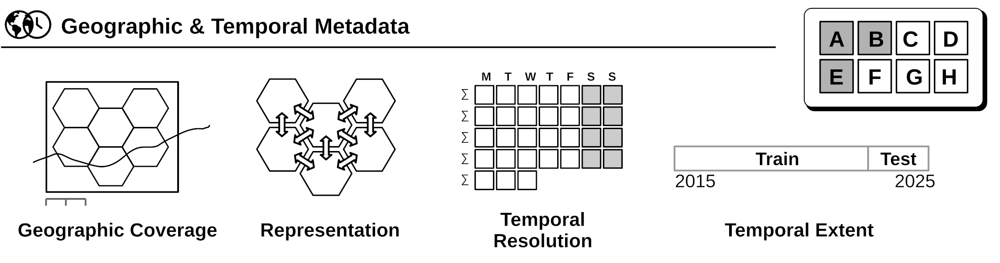
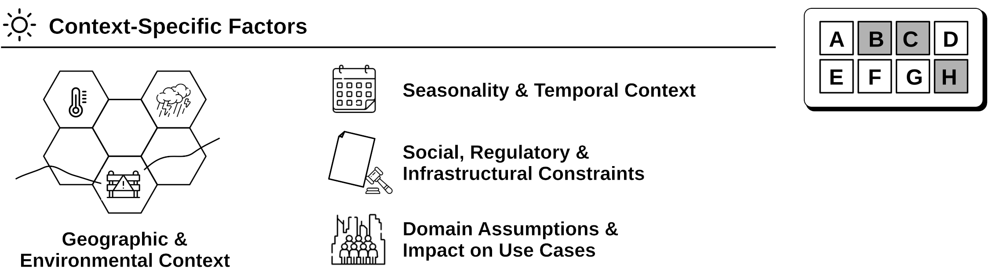
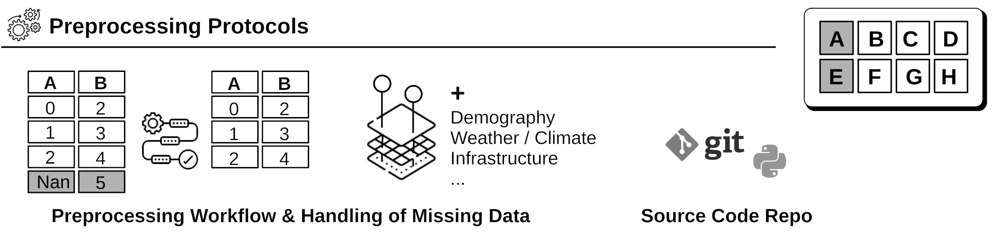
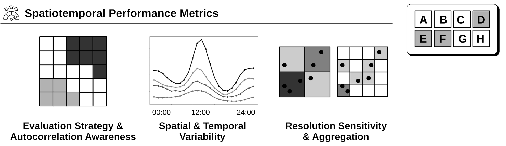
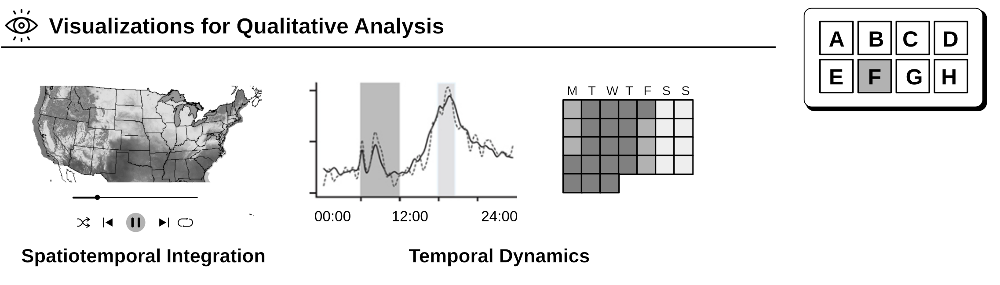
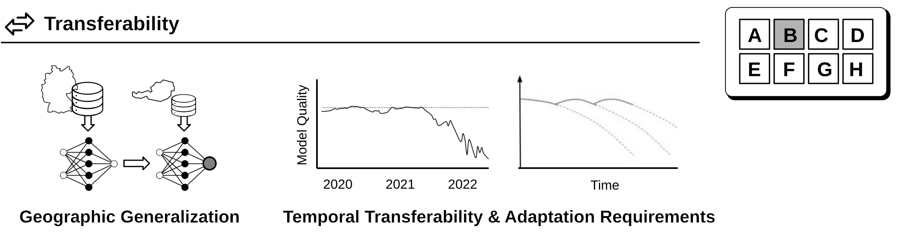
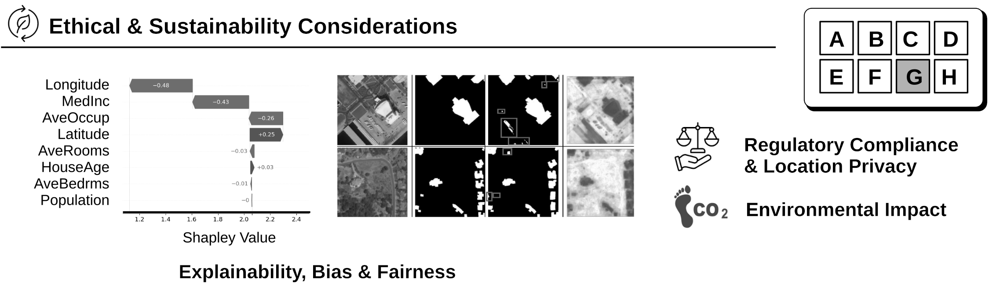

# Spatiotemporal Model Cards

The [STMCs framework](https://dl.acm.org/doi/pdf/10.1145/3809183) [[0]](#publications) introduces a set of components that extend the [original Model Cards by Mitchell et al. (2019)](https://arxiv.org/abs/1810.03993) to address the distinctive characteristics of spatiotemporal modeling. The following table provides an overview of the proposed new components and how they match the established Model Card sections:

➡️ [To the template](model-card-template.md)

## Overview

<table>
  <thead>
    <tr>
      <th style="width: 13%">Section</th>
      <th style="width: 40%">Original Model Cards</th>
      <th style="width: 47%">Extensions for Spatiotemporal Model Cards</th>
    </tr>
  </thead>
  <tbody>
    <tr>
      <td class="section-label">(A) Model details</td>
      <td><ul>
        <li>Name, purpose, date, version</li>
        <li>Developer contact</li>
        <li>Model type, training algorithms, parameters, fairness constraints, or other applied approaches, and features</li>
        <li>License, citation details, paper or other resource for more information</li>
      </ul></td>
      <td><ul>
        <li>Geographic coverage (bounding boxes, maps, region names)</li>
        <li>Temporal extent (time span for which the model is valid)</li>
        <li>Spatiotemporal resolution</li>
        <li>Spatiotemporal representation</li>
        <li>Source code repository (including software and hardware requirements)</li>
      </ul></td>
    </tr>
    <tr>
      <td class="section-label">(B) Intended use</td>
      <td><ul>
        <li>Primary intended use</li>
        <li>Primary intended users</li>
        <li>Out-of-scope use cases</li>
      </ul></td>
      <td><ul>
        <li>Transferability (applicability to different regions or conditions)</li>
        <li>Prediction horizon (for forecasting models)</li>
      </ul></td>
    </tr>
    <tr>
      <td class="section-label">(C) Factors</td>
      <td><ul>
        <li>Groups (of categories)</li>
        <li>Instrumentation (for capturing the data)</li>
        <li>Environment</li>
      </ul></td>
      <td><ul>
        <li>Domain-specific geographic, environmental and temporal context</li>
        <li>Real-world constraints and domain assumptions</li>
      </ul></td>
    </tr>
    <tr>
      <td class="section-label">(D) Metrics</td>
      <td><ul>
        <li>Model performance measures</li>
        <li>Decision thresholds</li>
        <li>Variation approaches</li>
      </ul></td>
      <td><ul>
        <li>Spatiotemporal performance/error metrics</li>
        <li>Spatiotemporal variability measures</li>
        <li>Autocorrelation handling</li>
      </ul></td>
    </tr>
    <tr>
      <td class="section-label">(E) Training and evaluation data</td>
      <td><ul>
        <li>Datasets</li>
        <li>Motivation</li>
        <li>Preprocessing</li>
      </ul></td>
      <td><ul>
        <li>Geographic and temporal coverage</li>
        <li>Spatiotemporal resolution and representation</li>
        <li>Handling of missing data</li>
      </ul></td>
    </tr>
    <tr>
      <td class="section-label">(F) Quantitative analyses</td>
      <td><ul>
        <li>Unitary results</li>
        <li>Intersectional results</li>
      </ul></td>
      <td><ul>
        <li>Spatiotemporal evaluation protocol</li>
        <li>Spatiotemporal visualizations</li>
      </ul></td>
    </tr>
    <tr>
      <td class="section-label">(G) Ethical considerations</td>
      <td><ul>
        <li>Data (privacy, fairness, biases)</li>
        <li>Human life</li>
        <li>Risks, harms, and their mitigation</li>
        <li>Use case-specific considerations</li>
      </ul></td>
      <td><ul>
        <li>Model transparency (explainability)</li>
        <li>Geographic and temporal biases</li>
        <li>Location privacy</li>
        <li>Regulatory compliance</li>
        <li>Environmental impact</li>
      </ul></td>
    </tr>
    <tr>
      <td class="section-label">(H) Caveats and recommendations</td>
      <td><ul>
        <li>General limitations and recommendations</li>
      </ul></td>
      <td><ul>
        <li>Recommended retraining frequencies</li>
        <li>Related Model Cards and cross-model comparisons</li>
      </ul></td>
    </tr>
  </tbody>
</table>

## STMC Framework

### Geographic and Temporal Metadata



*(Image source: own work, using icons by Freepik from Flaticon.com)*

### Context-Specific Factors



*(Image source: own work, using icons by Freepik from Flaticon.com)*

### Preprocessing Protocols



*(Image source: own work, using icons by Freepik from Flaticon.com)*

### Spatiotemporal Performance Metrics



*(Image source: own work, using icons by Freepik from Flaticon.com)*

### Visualizations for Qualitative Analysis



*(Image source: own work, using icons by Freepik from Flaticon.com)*

### Transferability



*(Image source: own work, using icons by Freepik from Flaticon.com)*

### Ethical and Sustainability Considerations



*(Image source: own work, using icons by Freepik from Flaticon.com and EO object detection illustration cc-by [Zaryabi et al. (2022)](https://www.mdpi.com/2072-4292/14/24/6254))*


## Publications

[0] [Graser, A., Wachsenegger, A., Doulkeridis, C., Theodoropoulos, G., Salehi, B., Dragaschnig, M., ... & Theodoridis, Y. (2026). Spatiotemporal Model Cards Enabling Future-Proof GeoAI Systems. ACM Transactions on Spatial Algorithms and Systems.](https://dl.acm.org/doi/abs/10.1145/3809183)

```
@article{10.1145/3809183,
author = {Graser, Anita and Wachsenegger, Anahid and Doulkeridis, Christos and Theodoropoulos, George and Salehi, Bahare and Dragaschnig, Melitta and Antoniou, Stathis and Theodoridis, Yannis},
title = {Spatiotemporal Model Cards Enabling Future-Proof GeoAI Systems},
year = {2026},
publisher = {Association for Computing Machinery},
address = {New York, NY, USA},
issn = {2374-0353},
url = {https://doi.org/10.1145/3809183},
doi = {10.1145/3809183},
abstract = {Spatiotemporal machine learning models are increasingly central to geographic information science but despite their growing impact, existing model documentation practices remain insufficient for capturing the spatial, temporal, and contextual dependencies that critically affect model validity, transferability, and responsible use. In this vision paper, we propose Spatiotemporal Model Cards (STMCs), a domain-agnostic extension of the Model Cards paradigm tailored to the unique characteristics of spatiotemporal models. The STMC framework integrates geographic and temporal metadata, autocorrelation-aware evaluation protocols, performance variability across space and time, transferability considerations, and ethical and sustainability aspects. Beyond model documentation, we outline how STMCs can serve as actionable interfaces within future-proof GeoAI systems, supporting model discovery, assessment, and reuse in both catalog-based and agentic (LLM-driven) settings. Using illustrative examples from the mobility domain, we demonstrate how STMCs help surface uncertainty, bias, and contextual limitations that are often obscured by aggregate performance metrics. We conclude by identifying key research challenges and directions for the GIScience community. STMCs provide a foundation for more transparent, reproducible, and responsible GeoAI practices.},
note = {Just Accepted},
journal = {ACM Trans. Spatial Algorithms Syst.},
month = apr
}
```
